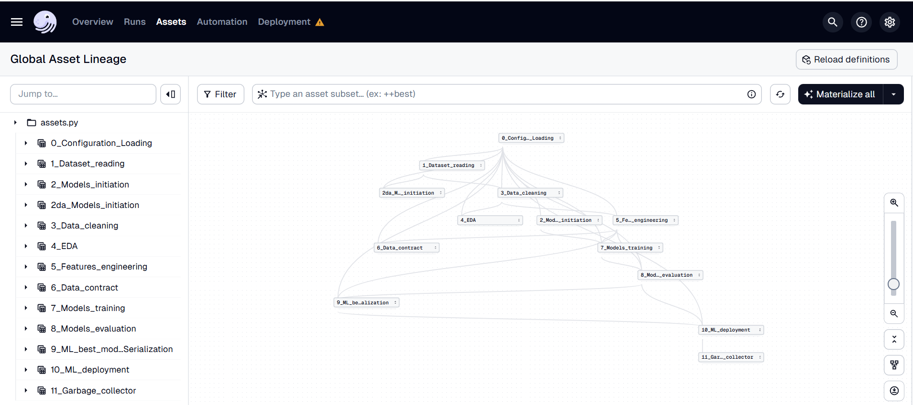

# 🧠 Machine Learning Pipeline – Documentation

Un pipeline complet de bout en bout pour le développement, la validation et le déploiement de modèles de machine learning.  
Chaque étape est modulaire, traçable et industrialisable.

---

## 📋 Étapes du pipeline

### `0_Config_Loading` ⚙️
Chargement de la configuration globale du projet :
- Chemins des fichiers
- Paramètres de logging
- Variables d'environnement

---

### `1_Dataset_reading` 📥
Lecture des jeux de données à partir de :
- Fichiers CSV, Excel, SQL
- APIs ou systèmes de stockage
- Ajout de metadata éventuelles

---

### `2da_M_initiation` 📑
Initialisation des métadonnées :
- Détection automatique de types
- Statistiques globales
- Structure des données

---

### `3_Data_cleaning` 🧼
Nettoyage des données :
- Suppression/Imputation des valeurs manquantes
- Correction des types et formats
- Détection et suppression des doublons
- Encodage des variables catégorielles
- Standardisation ou normalisation

---

### `4_EDA` 📊
Analyse exploratoire des données (Exploratory Data Analysis) :
- Visualisation des distributions, corrélations, outliers
- Analyse univariée / bivariée
- Compréhension des patterns et biais

---

### `2_Mod_initiation` 🧪
Initialisation du modèle :
- Sélection du ou des algorithmes (Random Forest, XGBoost, etc.)
- Définition des objectifs (classification, régression…)

---

### `5_Fe__engineering` 🛠️
Ingénierie des features :
- Création de nouvelles variables à partir des données existantes
- Transformation des features (log, binning, interaction)
- Sélection des variables importantes
- Réduction de dimension (PCA, UMAP)

---

### `6_Data_contract` 🧾
Contrat de données :
- Définition du schéma attendu (types, nullabilité, règles métier)
- Validation automatique de la qualité des données
- Contrôle de cohérence pour les déploiements futurs

---

### `7_Models_training` 🧠
Entraînement des modèles :
- Split train/test ou cross-validation
- Optimisation des hyperparamètres (GridSearch, Optuna…)
- Gestion du surapprentissage

---

### `8_Mod__evaluation` 📈
Évaluation des performances :
- Calcul des métriques (accuracy, F1-score, RMSE…)
- Analyse des erreurs
- Comparaison entre modèles

---

### `9_ML_be_alization` 🧰
Industrialisation du modèle :
- Sérialisation du modèle (pickle, joblib, ONNX…)
- Export des artifacts
- Logging des performances et du contexte d’entraînement

---

### `10_ML_deployment` 🚀
Déploiement du modèle :
- API REST / microservice
- Intégration dans un pipeline de production
- CI/CD pour les mises à jour

---

### `11_Gar__collector` 🗑️
Collecte et monitoring :
- Logs d’utilisation
- Détection de drift
- Alerte sur les performances en production

---

## 🧬 Objectifs
- ✅ **Modularité** : chaque étape est indépendante
- ✅ **Traçabilité** : historique des runs, logs, versioning
- ✅ **Robustesse** : validation des données et des performances
- ✅ **Scalabilité** : prêt pour l’industrialisation
