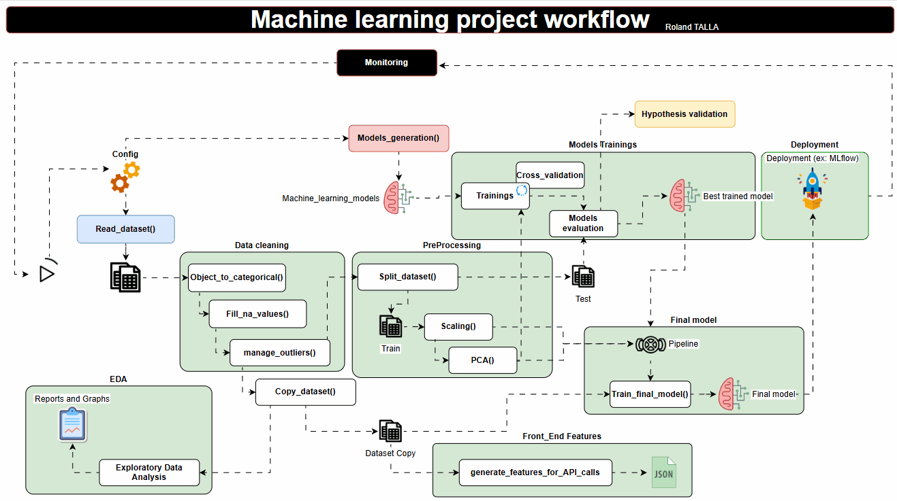

# 📊 Projet d’Analyse de Données & Modélisation Machine Learning

Bienvenue dans ce projet complet de **traitement de données**, **analyse exploratoire**, **ingénierie de features**, et **modélisation machine learning**, structuré pour garantir modularité, scalabilité et reproductibilité.


---

## 📁 Structure du Projet

```
.
├── README.md
├── structure.txt
├── Configs/                    # 🔧 Fichiers de configuration (.json)
├── Data/                       # 📂 Jeux de données bruts
├── Deployment/                # 🚀 Fichiers liés au déploiement
├── Functions/                 # 🧠 Fonctions modulaires
│   ├── build/                 # 🔨 Build interne
│   ├── Config_Loader/         # 🛠️ Chargeur de configuration
│   ├── Context/               # 🧾 Contexte du projet
│   ├── Data_cleaning/         # 🧹 Nettoyage des données
│   ├── EDA/                   # 📊 Analyse exploratoire
│   ├── Features_Engineering/  # 🏗️ Ingénierie des features
│   ├── Modelisation/          # 🤖 Modélisation machine learning
│   ├── Models_generation/     # 🏭 Génération automatique de modèles
│   ├── Pipeline_Modelisation/ # 🔁 Pipeline de modélisation
│   ├── Read_dataset/          # 📥 Chargement des datasets
│   ├── Report/                # 📝 Génération de rapports (DOCX / PDF)
│   └── Utils/                 # 🧰 Fonctions utilitaires
├── Orchestration/             # 📡 Orchestration (Airflow, scripts automatisés, etc.)
├── Project_EDA/               # 🔬 Projet EDA spécifique (Exploration & visualisation)
├── Project_ML/                # 🤖 Projet de Machine Learning
```

---

## 📚 Contenu Principal

### 🔧 `Configs/`
Contient des fichiers `.json` utilisés pour paramétrer dynamiquement le comportement des modules.

### 📂 `Data/` & `Project_EDA/Repositories/Data/`
Jeux de données utilisés pour l’analyse (ex. `cancer.csv`, `car_insurance.csv`, etc.).

### 📊 `Functions/EDA/`
Scripts pour générer des analyses descriptives, graphiques, et statistiques de base.

### 🧹 `Functions/Data_cleaning/`
Contient des fonctions pour la préparation des données (valeurs manquantes, doublons, etc.).

### 🏗️ `Functions/Features_Engineering/`
Extraction et transformation de variables (normalisation, encodage, etc.).

### 🤖 `Functions/Modelisation/` & `Models_generation/`
Création, entraînement et sauvegarde des modèles de machine learning.

### 🔁 `Functions/Pipeline_Modelisation/`
Implémente des pipelines scikit-learn pour chaîner preprocessing et modèle.

### 📑 `Functions/Report/`
Scripts de génération de rapports `.docx`, utiles pour automatiser la documentation des résultats.

---

## 🧪 Dossiers de Projets

### 🔬 `Project_EDA/`
Contient les analyses exploratoires par domaine :
- `Notebooks/`: notebooks Jupyter (`Explor_Data_Analysis.ipynb`)
- `Reports/`: rapports générés
- `Figures/`: graphiques (histogrammes, boxplots, matrices de corrélation, etc.)

### 🤖 `Project_ML/`
Contient la partie modélisation complète :
- `Models/`: modèles entraînés (ex. `xgboost_pipeline_model.joblib`)
- `Figures/`: courbes ROC AUC, matrices de confusion
- `Reports/`: rapports versionnés
- `Notebooks/`: workflow complet machine learning (`machine_learning.ipynb`)

---

## 🛠️ Fonctionnalités Clés

- ✅ **Chargement dynamique** des datasets et configs
- 📈 **Analyse exploratoire automatique**
- 🧠 **Création de pipelines machine learning**
- 🧹 **Prétraitement modulaire**
- 📝 **Rapports automatisés** avec visualisations
- 📦 **Packaging & modules réutilisables**

---

## 🚀 Déploiement

Le dossier `Deployment/` est prévu pour accueillir des scripts de déploiement (API, Docker, CI/CD…).

---

## 🧪 Tests

Les sous-dossiers `Tests/` dans les deux projets (`Project_EDA`, `Project_ML`) permettent de mettre en œuvre des tests unitaires ou fonctionnels.

---

## 📄 À venir

- [ ] Ajout d’une API pour la prédiction en ligne
- [ ] Automatisation avec Airflow ou Prefect
- [ ] Ajout de modèles deep learning

---

## 👨‍💻 Auteur

> Projet développé avec ❤️ par une approche modulaire et professionnelle de la science des données.
